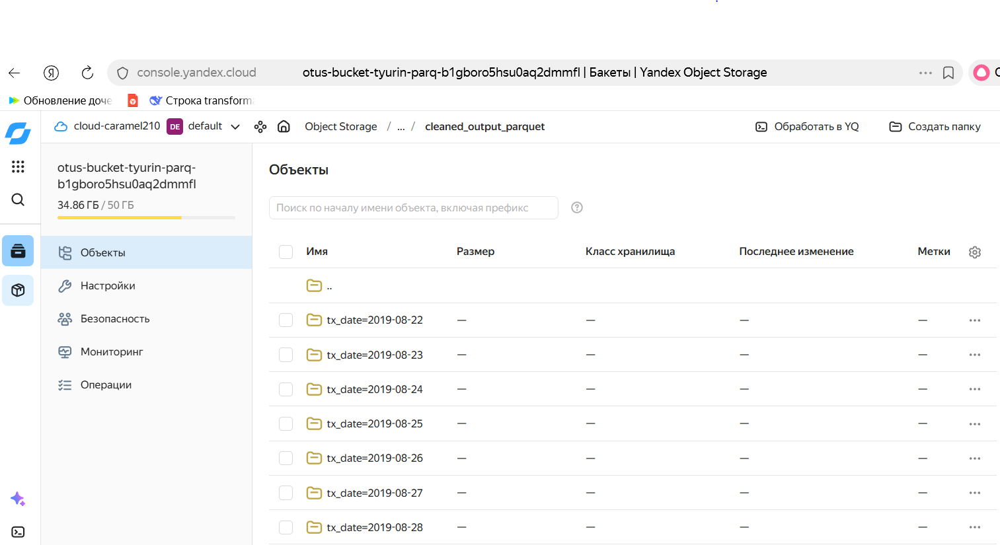

# Запуск пайплайна:
С указанием проблемных дат: 
`python3 clean_transactions_final.py \
  --input-path "/home/user/data/raw_txt_files/" \
  --output-path "/home/user/data/cleaned_parquet_output/" \
  --bad-dates "2022-11-24,2022-11-25,2022-11-26,2022-11-27,2022-11-29,2022-11-30,2022-12-01,2022-12-02,2022-12-03"`

Рутинный ежедневный запуск:
`python3 clean_transactions_final.py \
  --input-path "/home/user/data/raw_txt_files/" \
  --output-path "/home/user/data/cleaned_parquet_output/" `

# Готовый parquet в s3
