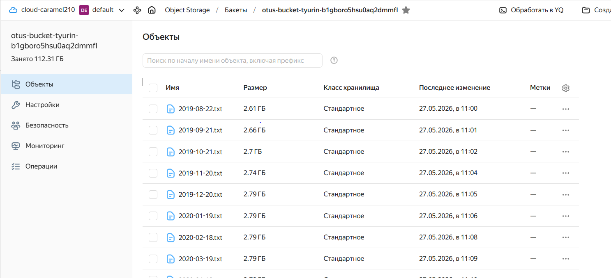
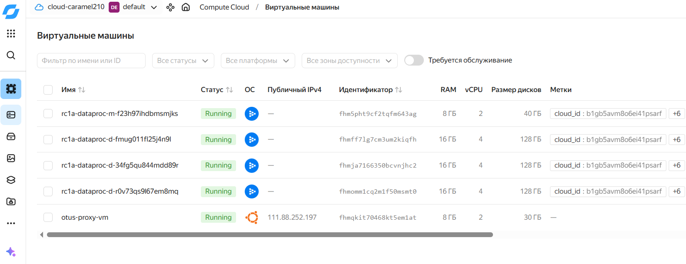

# OTUS. Настройка облачной инфраструктуры
# Настройка облачной инфраструктуры для проекта по определению мошеннических транзакций

### Обязательные задания

1. **Создать новый bucket в Yandex Cloud Object Storage** с использованием terraform скрипта.
```
s3a://otus-bucket-tyurin-b1gboro5hsu0aq2dmmfl
```

2. **Скопировать содержимое предоставленного хранилища** с использованием инструмента `s3cmd`и указать ссылку на личный бакет:


3. **Создать Spark-кластер в Yandex Data Processing** с двумя подкластерами согласно указанным характеристикам.


4. **Соединиться по SSH с мастер-узлом** и выполнить на нём команду копирования содержимого хранилища в файловую систему HDFS с использованием инструмента `hadoop distcp`.
```
[Wed 27 May 2026 01:07:44 PM UTC] ---------------------------------------------------------- 
[Wed 27 May 2026 01:07:44 PM UTC] [INFO] Listing files in HDFS directory
Found 40 items
-rw-r--r--   1 ubuntu hadoop 2807409271 2026-05-27 12:39 /user/ubuntu/data/2019-08-22.txt
-rw-r--r--   1 ubuntu hadoop 2854479008 2026-05-27 12:48 /user/ubuntu/data/2019-09-21.txt
-rw-r--r--   1 ubuntu hadoop 2895460543 2026-05-27 12:46 /user/ubuntu/data/2019-10-21.txt
-rw-r--r--   1 ubuntu hadoop 2939120942 2026-05-27 12:55 /user/ubuntu/data/2019-11-20.txt
-rw-r--r--   1 ubuntu hadoop 2995462277 2026-05-27 12:40 /user/ubuntu/data/2019-12-20.txt
-rw-r--r--   1 ubuntu hadoop 2994906767 2026-05-27 12:57 /user/ubuntu/data/2020-01-19.txt
-rw-r--r--   1 ubuntu hadoop 2995431240 2026-05-27 13:07 /user/ubuntu/data/2020-02-18.txt
-rw-r--r--   1 ubuntu hadoop 2995176166 2026-05-27 12:49 /user/ubuntu/data/2020-03-19.txt
-rw-r--r--   1 ubuntu hadoop 2996034632 2026-05-27 12:36 /user/ubuntu/data/2020-04-18.txt
-rw-r--r--   1 ubuntu hadoop 2995666965 2026-05-27 12:59 /user/ubuntu/data/2020-05-18.txt
-rw-r--r--   1 ubuntu hadoop 2994699401 2026-05-27 12:44 /user/ubuntu/data/2020-06-17.txt
-rw-r--r--   1 ubuntu hadoop 2995810010 2026-05-27 13:03 /user/ubuntu/data/2020-07-17.txt
-rw-r--r--   1 ubuntu hadoop 2995995152 2026-05-27 12:51 /user/ubuntu/data/2020-08-16.txt
-rw-r--r--   1 ubuntu hadoop 2995778382 2026-05-27 13:04 /user/ubuntu/data/2020-09-15.txt
-rw-r--r--   1 ubuntu hadoop 2995868596 2026-05-27 12:42 /user/ubuntu/data/2020-10-15.txt
-rw-r--r--   1 ubuntu hadoop 2995467533 2026-05-27 12:48 /user/ubuntu/data/2020-11-14.txt
-rw-r--r--   1 ubuntu hadoop 2994761624 2026-05-27 12:45 /user/ubuntu/data/2020-12-14.txt
-rw-r--r--   1 ubuntu hadoop 2995390576 2026-05-27 13:06 /user/ubuntu/data/2021-01-13.txt
-rw-r--r--   1 ubuntu hadoop 2995780517 2026-05-27 12:50 /user/ubuntu/data/2021-02-12.txt
-rw-r--r--   1 ubuntu hadoop 2995191659 2026-05-27 12:35 /user/ubuntu/data/2021-03-14.txt
-rw-r--r--   1 ubuntu hadoop 2995446495 2026-05-27 12:37 /user/ubuntu/data/2021-04-13.txt
-rw-r--r--   1 ubuntu hadoop 3029170975 2026-05-27 12:47 /user/ubuntu/data/2021-05-13.txt
-rw-r--r--   1 ubuntu hadoop 3042691991 2026-05-27 12:44 /user/ubuntu/data/2021-06-12.txt
-rw-r--r--   1 ubuntu hadoop 3041980335 2026-05-27 13:02 /user/ubuntu/data/2021-07-12.txt
-rw-r--r--   1 ubuntu hadoop 3042662187 2026-05-27 12:54 /user/ubuntu/data/2021-08-11.txt
-rw-r--r--   1 ubuntu hadoop 3042455173 2026-05-27 13:02 /user/ubuntu/data/2021-09-10.txt
-rw-r--r--   1 ubuntu hadoop 3042424238 2026-05-27 12:56 /user/ubuntu/data/2021-10-10.txt
-rw-r--r--   1 ubuntu hadoop 3042358698 2026-05-27 13:01 /user/ubuntu/data/2021-11-09.txt
-rw-r--r--   1 ubuntu hadoop 3042923985 2026-05-27 12:43 /user/ubuntu/data/2021-12-09.txt
-rw-r--r--   1 ubuntu hadoop 3042868087 2026-05-27 12:38 /user/ubuntu/data/2022-01-08.txt
-rw-r--r--   1 ubuntu hadoop 3043148790 2026-05-27 12:40 /user/ubuntu/data/2022-02-07.txt
-rw-r--r--   1 ubuntu hadoop 3042312191 2026-05-27 12:52 /user/ubuntu/data/2022-03-09.txt
-rw-r--r--   1 ubuntu hadoop 3041973966 2026-05-27 13:00 /user/ubuntu/data/2022-04-08.txt
-rw-r--r--   1 ubuntu hadoop 3073760161 2026-05-27 13:06 /user/ubuntu/data/2022-05-08.txt
-rw-r--r--   1 ubuntu hadoop 3089378246 2026-05-27 12:52 /user/ubuntu/data/2022-06-07.txt
-rw-r--r--   1 ubuntu hadoop 3089589719 2026-05-27 13:05 /user/ubuntu/data/2022-07-07.txt
-rw-r--r--   1 ubuntu hadoop 3090000257 2026-05-27 12:41 /user/ubuntu/data/2022-08-06.txt
-rw-r--r--   1 ubuntu hadoop 3089390874 2026-05-27 12:57 /user/ubuntu/data/2022-09-05.txt
-rw-r--r--   1 ubuntu hadoop 3109468067 2026-05-27 12:58 /user/ubuntu/data/2022-10-05.txt
-rw-r--r--   1 ubuntu hadoop 3136657969 2026-05-27 12:53 /user/ubuntu/data/2022-11-04.txt
[Wed 27 May 2026 01:07:46 PM UTC] ---------------------------------------------------------- 
[Wed 27 May 2026 01:07:46 PM UTC] [INFO] Data was successfully copied to HDFS
```

5. **Оценить месячные затраты** используя тарифный калькулятор Yandex Cloud для поддержания работоспособности созданного кластера. Оценить, насколько использование HDFS-хранилища дороже, чем объектного:
```
S3 холодного типа объемем 1000Гб в месяц будет стоить - 1269,00руб
Стандартный диск (HDD) - 3456,00руб 
Хранить сырые данные и результаты обработки в Object Storage выгоднее: S3 — как основное хранилище, HDFS — как временное
```

### Дополнительные задания

6. **Предложить способы для оптимизации затрат** на содержание Spark-кластера в облаке и попробовать их реализовать.
```
1 Автомасштабирование подкластеров в зависимости от нагрузки (автоскейлинг)
2 Хранение данных в Object Storage вместо HDFS
3 Остановка кластера в нерабочее время
```

7. **Изменить статус задач** на Kanban-доске в GitHub Projects в соответствии с достигнутыми результатами. Возможно, некоторые задачи нужно будет скорректировать, разделить на подзадачи или объединить друг с другом.

8. **Полностью удалить созданный кластер** с помощью команды `terraform destroy`, чтобы избежать оплаты ресурсов в период его простаивания.
```
Done
```

## Лицензия

MIT